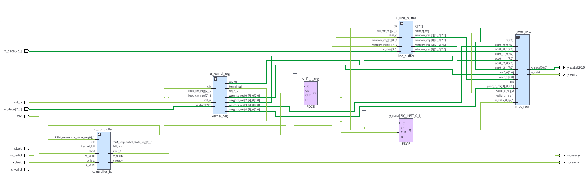

# int8-depthwise-convolution-accelerator

`int8-depthwise-conv-accelerator` is a parameterized weight-stationary `INT8` 1D convolution accelerator implemented in SystemVerilog, targeting an AMD/Xilinx Artix-7 FPGA.

The accelerator uses a `K`-deep sliding input window and stationary kernel registers feeding a parallel DSP-based MAC datapath. Inputs and weights are signed `INT8`, with a wider signed accumulator sized according to the kernel size. The design implements valid-only cross-correlation, producing `N-K+1` outputs for an input of `N` samples and kernel size `K`.

The design is verified using `cocotb` + `Verilator` against a NumPy golden-reference model, including randomized tests, streaming stalls, kernel reloads, reset behavior, and signed INT8 extremes.

The design is synthesized for the Artix-7 `xc7a100tcsg324-1`, using 5 DSP48E1 blocks and closing timing at the 100 MHz target with **+2.508 ns WNS**.

## Results

| **Metric**              |          **Value** |
| ----------------------- | -----------------: |
| Kernel Size             |  5 (parameterized) |
| Data Type               |        INT8 signed |
| Target Frequency        |            100 MHz |
| Achieved Timing         |      +2.508 ns WNS |
| DSP48E1                 |      5/240 (2.08%) |
| LUTs                    |  28/63,400 (0.04%) |
| Flip-Flops              | 95/126,800 (0.07%) |
| Block RAM               |                  0 |
| Timing Violations       |                  0 |
| Randomized Verification |      10,000 trials |


## Architecture



The accelerator consists of four main datapath/control components: a **kernel register bank** that keeps the weights stationary, a **line buffer** that generates the sliding input window, a **parallel MAC datapath** implemented using DSP48E1 resources, and a **controller FSM** that sequences the operation.

### Kernel Register

The kernel is streamed in one weight per cycle and stored in `K` registers. Once loaded, the weights remain stationary while every subsequent input window reuses the same coefficients.

### Line Buffer

The line buffer maintains a `K`-sample sliding window. Each accepted input sample shifts the window by one position. Outputs are only considered valid once the window contains `K` real samples.

### MAC Datapath

The MAC datapath performs the `K` signed INT8 multiplications in parallel and accumulates the products into a wider signed result.

The multiply datapath is mapped to the FPGA's dedicated DSP48E1 resources. A pipeline register was added after the multiplication stage to break the long DSP cascade and improve timing closure.

### Controller / Streaming Wrapper

The controller sequences:

```text
IDLE → LOAD_WEIGHTS → STREAM_IN → STREAM_OUT
```

`conv_top.sv` exposes streaming `valid/ready` interfaces for loading weights, accepting input samples, and consuming output results.

The output stream produces exactly `N-K+1` results for an input containing `N` samples.

## Quick Start

Requires: Python 3.10+, Verilator, cocotb, and Vivado 2025.2 for FPGA synthesis/implementation.

```bash
git clone <repository-url>
cd int8-depthwise-conv-accelerator

python -m venv .venv
source .venv/bin/activate
pip install -r requirements.txt
```

### Run Verification

The integration tests use cocotb + Verilator and compare the RTL output against the NumPy golden model.

```bash
make cocotb
```

The test suite includes randomized trials, streaming stalls, kernel reloads, reset during streaming, boundary cases, and INT8 extreme values.

### Run FPGA Implementation

The provided Vivado Tcl script runs the out-of-context synthesis, optimization, placement, routing, and report generation flow.

```tcl
source syn/run_impl.tcl
```

The resulting reports are written to:

```text
docs/timing.rpt
docs/util.rpt
```

## Verification

- **Golden model** (`test/golden_model.py`): NumPy reference implementation used as the bit-exact functional reference.
- **Integration tests** (`test/test_top.py`): cocotb + Verilator tests driving the complete `conv_top` streaming interface.
- **Randomized testing**: 10,000 random convolution trials.
- **Streaming stalls**: 500 randomized trials with input/output backpressure.
- **Boundary tests**: verifies valid-only behavior and the `N-K+1` output count.
- **Kernel reload**: verifies consecutive convolutions with different kernels without a hard reset.
- **Saturation/extreme values**: verifies signed INT8 corner cases and accumulator headroom.
- **Parameterization**: integration tests can be rerun with different `K` values without RTL changes.

## Timing

The design targets a 100 MHz clock with a 10 ns period.

```text
WNS:  +2.508 ns
WHS:  +0.151 ns
TNS:   0.000 ns
THS:   0.000 ns
```

All user-specified timing constraints are met.

The critical setup path is between DSP48E1 stages, with a reported data-path delay of approximately 5.92 ns.

## Repo Layout

```text
int8-depthwise-conv-accelerator/
│
├── docs/
│   ├── imgs/
│   │   └── architecture.png
│   ├── timing.rpt
│   └── util.rpt
│
├── rtl/
│   ├── conv_top.sv
│   ├── controller_fsm.sv
│   ├── kernel_reg.sv
│   ├── line_buffer.sv
│   └── mac_row.sv
│
├── test/
│   ├── golden_model.py
│   └── test_top.py
│
├── syn/
│   └── run_impl.tcl
│
└── README.md
```

## Future Work

- Explore additional DSP48E1 pipelining for higher Fmax
- Extend the architecture to multiple input/output channels
- Add board-level hardware validation
- Explore larger streaming buffers using BRAM
